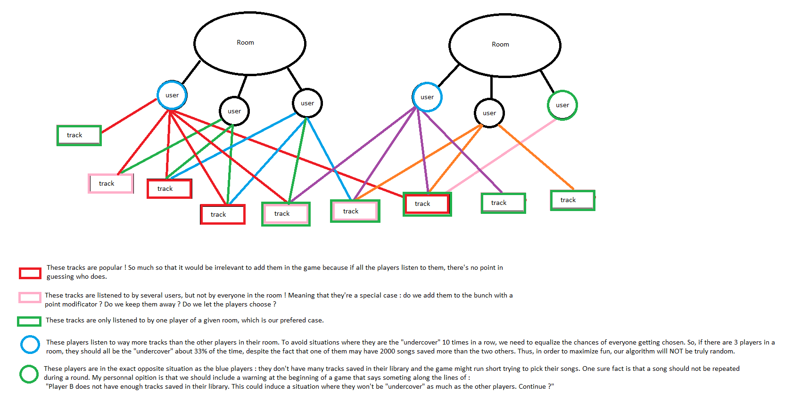

# Guessify

Work in progress !

Guessify is a browser game where players link their spotify account to the app, which then plays a random song. To earn points, players have to guess who in the room listens to the song currently playing.
This being a Python project means that I will most likely be meddling with Django in the near future, but for the moment I am still only fidgeting with the Spotify API.

Also, Apple Music support is very unlikely unless someone provides me with a free Apple developer account.

Anyway, here's a very skilled MS Paint drawing of some of my thoughts.

